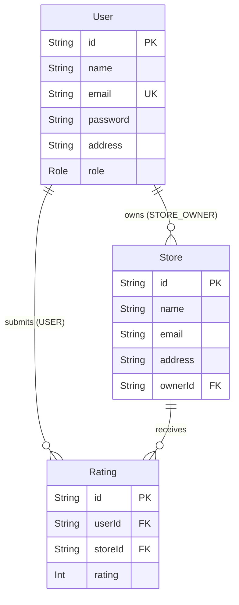

# Roxiler Store Rating Platform — Backend

A role-based RESTful API for a store rating system, built with Node.js, Express, Prisma ORM, and PostgreSQL (Neon). Three distinct roles — **System Administrator**, **Normal User**, and **Store Owner** — each have access to their own set of protected endpoints.

---

## Table of Contents

1. [Project Overview](#project-overview)
2. [Technology Stack](#technology-stack)
3. [Architecture](#architecture)
4. [Project Structure](#project-structure)
5. [Database Design](#database-design)
6. [Authentication & Authorization](#authentication--authorization)
7. [Validation Rules](#validation-rules)
8. [API Reference](#api-reference)
9. [Filtering, Sorting & Pagination](#filtering-sorting--pagination)
10. [Rating System](#rating-system)
11. [Role Permission Matrix](#role-permission-matrix)
12. [Error Handling](#error-handling)
13. [Security Considerations](#security-considerations)
14. [Environment Variables](#environment-variables)
15. [Setup Instructions](#setup-instructions)
16. [Design Decisions & Trade-offs](#design-decisions--trade-offs)
17. [Testing Status](#testing-status)
18. [Future Improvements](#future-improvements)

---

## Project Overview

This backend powers a **store rating platform** where:

| Role | Capabilities |
|------|-------------|
| **System Administrator** | Creates and manages all users and stores; views dashboard statistics (total users, stores, ratings) |
| **Normal User** | Browses all stores with search/filter/sort; submits and updates their own store rating (1–5) |
| **Store Owner** | Views their owned stores via a dashboard showing average ratings, rating counts, and individual rater details |

Public registration always produces a `USER` account. `ADMIN` and `STORE_OWNER` accounts can only be created by an existing Administrator.

---

## Technology Stack

| Technology | Version | Purpose |
|---|---|---|
| **Node.js** | ≥ 18 | Runtime (built-in `fetch`, ES Modules) |
| **Express.js** | ^4.19 | HTTP framework and routing |
| **PostgreSQL** | Neon cloud | Relational database |
| **Prisma ORM** | ^5.14 | Type-safe database client and schema management |
| **jsonwebtoken** | ^9.0 | JWT generation and verification |
| **bcryptjs** | ^2.4 | Password hashing and comparison |
| **cors** | ^2.8 | Cross-origin resource sharing |
| **dotenv** | ^16.4 | Environment variable loading |
| **nodemon** | ^3.1 | Hot-reload during development |

All source files use **JavaScript ES Modules** (`"type": "module"` in `package.json`).

---

## Architecture

Every request flows through a strict layered pipeline:

```
Client Request
      ↓
  Express Router        ← declares the route and its middleware chain
      ↓
  Middleware            ← protect (JWT verification) + authorizeRoles (RBAC)
      ↓
  Validator             ← validates request body / query params / path params
      ↓
  Controller            ← reads req, calls service, sends response
      ↓
  Service               ← all business logic, Prisma queries
      ↓
  Prisma Client         ← single shared instance (src/config/prisma.js)
      ↓
  PostgreSQL (Neon)
```

**Layer responsibilities:**

| Layer | File(s) | Responsibility |
|---|---|---|
| Router | `src/routes/*.js` | Declare paths, attach middleware chains |
| Middleware | `src/middleware/*.js` | Auth, role checks, 404, error handling |
| Validator | `src/validators/*.js` | Input validation, return 422 on failure |
| Controller | `src/controllers/*.js` | Thin HTTP adapter — reads `req`, calls service, writes `res` |
| Service | `src/services/*.js` | Business logic, Prisma calls, error objects with `statusCode` |
| Config | `src/config/index.js` | Centralised `process.env` reader (frozen object) |
| Utils | `src/utils/*.js` | JWT, bcrypt, response helpers |

### Why `app.js` and `server.js` are separated

`app.js` creates and configures the Express application — middleware, routes, error handlers — but **never calls `app.listen()`**.

`server.js` loads `.env`, imports `app`, and binds a port. This separation means integration tests can import `app` directly without opening a real network socket (the [supertest](https://github.com/ladjs/supertest) pattern).

---

## Project Structure

```
server/
├── prisma/
│   ├── schema.prisma          # Database schema — source of truth
│   └── migrations/            # Prisma migration history (do not edit)
├── scripts/
│   ├── qa-clean.js            # QA utility: clear application data
│   └── qa-seed.js             # QA utility: seed controlled test dataset
├── src/
│   ├── app.js                 # Express app factory (no listen call)
│   ├── server.js              # Entry point: loads env, starts HTTP server
│   ├── config/
│   │   ├── index.js           # Frozen config object from process.env
│   │   └── prisma.js          # Shared PrismaClient singleton
│   ├── controllers/
│   │   ├── authController.js  # register, login, getMe, updatePassword
│   │   ├── adminController.js # getDashboard, createUser, listUsers, getUserById,
│   │   │                      #   createStore, listStores
│   │   ├── storeController.js # listStores, submitRating, updateRating
│   │   └── ownerController.js # getDashboard
│   ├── middleware/
│   │   ├── authMiddleware.js  # protect() — JWT verification
│   │   ├── authorizeRoles.js  # authorizeRoles(...roles) — RBAC
│   │   ├── errorHandler.js    # Centralised Express error handler (4-arg)
│   │   └── notFound.js        # 404 fallback for unmatched routes
│   ├── routes/
│   │   ├── index.js           # API router — mounts all domain routers at /api
│   │   ├── healthRoutes.js    # GET /api/health
│   │   ├── authRoutes.js      # /api/auth/*
│   │   ├── adminRoutes.js     # /api/admin/* (ADMIN only)
│   │   ├── storeRoutes.js     # /api/stores/* (USER only)
│   │   └── ownerRoutes.js     # /api/owner/* (STORE_OWNER only)
│   ├── services/
│   │   ├── authService.js     # register, login, getMe, updatePassword
│   │   ├── adminService.js    # getDashboard, createUser, listUsers,
│   │   │                      #   getUserById, createStore, listStores
│   │   ├── storeService.js    # listStores, submitRating, updateRating
│   │   └── ownerService.js    # getDashboard
│   ├── utils/
│   │   ├── jwt.js             # generateToken, verifyToken (jsonwebtoken)
│   │   ├── password.js        # hashPassword, comparePassword (bcryptjs)
│   │   └── response.js        # sendSuccess, sendError — consistent JSON envelopes
│   └── validators/
│       ├── authValidator.js   # validateRegister, validateLogin, validatePasswordUpdate
│       ├── adminValidator.js  # validateAdminCreateUser, validateListUsers,
│       │                      #   validateUuidParam, validateAdminCreateStore,
│       │                      #   validateListStores
│       ├── storeValidator.js  # validateListStores, validateStoreIdParam, validateRating
│       └── ownerValidator.js  # validateOwnerDashboardQuery
├── .env.example               # Required environment variable template
├── .gitignore
└── package.json               # "type": "module", Node ≥ 18 required
```

---

## Database Design

### Models

#### User
```
id        String   @id @default(uuid())
name      String
email     String   @unique
password  String   (bcrypt hash — NEVER plaintext)
address   String
role      Role     @default(USER)   (ADMIN | USER | STORE_OWNER)
createdAt DateTime @default(now())
updatedAt DateTime @updatedAt
```
Indexes: `email` (unique), `name`, `address`, `role`

#### Store
```
id        String   @id @default(uuid())
name      String
email     String
address   String
ownerId   String   → User.id (onDelete: Restrict)
createdAt DateTime @default(now())
updatedAt DateTime @updatedAt
```
Indexes: `name`, `address`, `ownerId`

> `averageRating` and `ratingCount` are **not stored columns**. They are calculated on demand from the `Rating` table using `AVG()` and `COUNT()` aggregates.

#### Rating
```
id        String   @id @default(uuid())
userId    String   → User.id  (onDelete: Restrict)
storeId   String   → Store.id (onDelete: Restrict)
rating    Int      (1–5, enforced by CHECK constraint in migration SQL)
createdAt DateTime @default(now())
updatedAt DateTime @updatedAt

@@unique([userId, storeId])
```
Indexes: `storeId`, composite unique `(userId, storeId)`

### Relationships



### Key Constraints

| Constraint | Location | Enforcement |
|---|---|---|
| One email per user | `User.email @unique` | PostgreSQL unique index |
| One rating per user per store | `@@unique([userId, storeId])` | PostgreSQL unique index |
| Rating value 1–5 | `CHECK (rating >= 1 AND rating <= 5)` | Migration SQL + app validation |
| Store must have an owner | `ownerId NOT NULL` | Prisma schema |
| Cannot delete a user who owns stores | `onDelete: Restrict` on `Store.owner` | PostgreSQL FK |
| Cannot delete a user who has ratings | `onDelete: Restrict` on `Rating.user` | PostgreSQL FK |

#### Why `@@unique([userId, storeId])`?

This composite unique index guarantees at the **database level** that one user can submit exactly one rating per store. Application-level checks alone are insufficient — concurrent POST requests could both pass the duplicate check before either insert completes. The database constraint is the definitive safety net. Prisma surfaces this as a `P2002` unique constraint violation, which the service layer catches and returns as `409 Conflict`.

---

## Authentication & Authorization

### Registration

```
POST /api/auth/register
```

- Role is **hardcoded to `USER`** in the service layer. Any `role` field sent by the client is silently discarded via destructuring before the database call. This prevents privilege escalation at the code level, not just at the validation level.
- Password is hashed with **bcryptjs** (10 salt rounds) before being stored.
- Returns a JWT + safe user object on success.

### Login

```
POST /api/auth/login
```

- Both "email not found" and "wrong password" return the **same generic 401** message (`"Invalid email or password."`). This prevents user-enumeration attacks.
- Returns a JWT + safe user object on success.

### JWT

Token payload contains only the minimum claims needed:

```json
{ "userId": "<uuid>", "role": "USER|ADMIN|STORE_OWNER", "iat": ..., "exp": ... }
```

Sensitive fields (email, address, password) are deliberately excluded — JWTs are base64-encoded, not encrypted.

### Authentication Middleware (`protect`)

Reads `Authorization: Bearer <token>`, calls `verifyToken`, and attaches `{ userId, role }` to `req.user`. **No database query** is made — the JWT is self-contained. Returns 401 on any failure.

### Authorization Middleware (`authorizeRoles`)

Must run after `protect`. Compares `req.user.role` against the allowed roles. Returns 403 if the role is not permitted.

```
protect → authorizeRoles('ADMIN') → controller
```

Admin routes use `router.use(protect, authorizeRoles('ADMIN'))`, applying both middlewares to every route in the file.

### Password Update

After a password change, existing JWTs remain valid until their natural expiry (`JWT_EXPIRES_IN`). Server-side token invalidation (Redis blocklist, etc.) is not implemented.

---

## Validation Rules

All validators return `422 Unprocessable Entity` with an `errors` array on failure.

| Field | Rule |
|---|---|
| `name` | 20–60 characters (trimmed) |
| `email` | Valid email format (`user@domain.tld`) |
| `address` | Required; max 400 characters |
| `password` | 8–16 characters; ≥ 1 uppercase letter; ≥ 1 special character (`!@#$%^&*...`) |
| `rating` | Integer; 1–5 inclusive |
| `storeId` / `id` (path params) | Valid UUID v4 format |
| `role` (admin only) | One of `ADMIN`, `USER`, `STORE_OWNER` |
| `sortBy` | Whitelisted per-endpoint (see below) |
| `sortOrder` | `asc` or `desc` |
| `page` | Positive integer |
| `limit` | Positive integer; max 100 |

---

## API Reference

**Base URL:** `http://localhost:5000/api`

All responses use the envelope:

```json
// Success
{ "success": true, "message": "...", "data": { ... } }

// Error
{ "success": false, "message": "..." }

// Validation error
{ "success": false, "message": "Validation failed.", "errors": ["..."] }
```

---

### Health

#### `GET /api/health`

No authentication required.

**Response 200:**
```json
{ "success": true, "message": "API is running", "data": { "status": "ok", "environment": "development", "timestamp": "..." } }
```

---

### Authentication

#### `POST /api/auth/register`

Public endpoint. Always creates a `USER` account regardless of any `role` field in the body.

**Request body:**
```json
{
  "name":     "Full Name At Least Twenty",
  "email":    "user@example.com",
  "password": "Secret@1",
  "address":  "123 Main Street, City"
}
```

| Status | Condition |
|---|---|
| 201 | Registration successful — returns `{ token, user }` |
| 409 | Email already registered |
| 422 | Validation failure (name, email, password, address rules) |

---

#### `POST /api/auth/login`

**Request body:**
```json
{ "email": "user@example.com", "password": "Secret@1" }
```

| Status | Condition |
|---|---|
| 200 | Login successful — returns `{ token, user }` |
| 401 | Invalid email or password (same message for both cases) |
| 422 | Missing or invalid email format |

**Response `user` object never includes `password`.**

---

#### `GET /api/auth/me`

**Auth:** `Bearer <token>` (any role)

| Status | Condition |
|---|---|
| 200 | Returns the authenticated user's profile |
| 401 | No token / invalid token / expired token |

---

#### `PATCH /api/auth/password`

**Auth:** `Bearer <token>` (any role)

**Request body:**
```json
{
  "currentPassword": "OldSecret@1",
  "newPassword":     "NewSecret@2"
}
```

| Status | Condition |
|---|---|
| 200 | Password updated successfully |
| 401 | Current password incorrect or user not found |
| 422 | `newPassword` fails validation, or same as `currentPassword` |

---

### Administrator Endpoints

All admin endpoints require `Authorization: Bearer <ADMIN_token>`.

#### `GET /api/admin/dashboard`

Returns real-time counts from the database.

**Response 200:**
```json
{
  "data": {
    "totalUsers":   12,
    "totalStores":  6,
    "totalRatings": 18
  }
}
```

| Status | Condition |
|---|---|
| 200 | Statistics returned |
| 401 | No/invalid token |
| 403 | Role is not ADMIN |

---

#### `POST /api/admin/users`

Create a user with any role.

**Request body:**
```json
{
  "name":     "Full Name At Least Twenty",
  "email":    "user@example.com",
  "password": "Secret@1",
  "address":  "123 Main Street",
  "role":     "USER | ADMIN | STORE_OWNER"
}
```

| Status | Condition |
|---|---|
| 201 | User created — returns safe user (no password) |
| 409 | Email already registered |
| 422 | Validation failure |

---

#### `GET /api/admin/users`

List all users with optional filters, sorting, and pagination.

**Query parameters:**

| Param | Type | Description |
|---|---|---|
| `name` | string | Case-insensitive substring match |
| `email` | string | Case-insensitive substring match |
| `address` | string | Case-insensitive substring match |
| `role` | string | Exact match: `ADMIN`, `USER`, or `STORE_OWNER` |
| `sortBy` | string | `name`, `email`, `address`, `role`, `createdAt` (default: `name`) |
| `sortOrder` | string | `asc` or `desc` (default: `asc`) |
| `page` | integer | Page number ≥ 1 (default: `1`) |
| `limit` | integer | Results per page 1–100 (default: `10`) |

**Response 200:**
```json
{
  "data": {
    "users": [ { "id": "...", "name": "...", "email": "...", "role": "...", ... } ],
    "pagination": { "page": 1, "limit": 10, "total": 42, "totalPages": 5 }
  }
}
```

| Status | Condition |
|---|---|
| 200 | Users returned |
| 422 | Invalid sort field, invalid sort order, invalid page/limit |

---

#### `GET /api/admin/users/:id`

Retrieve full details for a single user.

- For `STORE_OWNER` users: includes `stores[]` with `averageRating` and `ratingCount` per store.
- For all other roles: `stores` is omitted.
- Password is never returned.

**Path param:** `id` — must be a valid UUID.

| Status | Condition |
|---|---|
| 200 | User details returned |
| 404 | No user with that ID |
| 422 | `id` is not a valid UUID |

**STORE_OWNER response shape:**
```json
{
  "data": {
    "id": "...", "name": "...", "email": "...", "role": "STORE_OWNER",
    "stores": [
      { "id": "...", "name": "...", "averageRating": 4.25, "ratingCount": 2 }
    ]
  }
}
```

---

#### `POST /api/admin/stores`

Create a store and assign it to a `STORE_OWNER`.

**Request body:**
```json
{
  "name":    "Store Name At Least Twenty",
  "email":   "store@example.com",
  "address": "456 Store Street",
  "ownerId": "<uuid of a STORE_OWNER user>"
}
```

| Status | Condition |
|---|---|
| 201 | Store created |
| 404 | `ownerId` does not match any user |
| 422 | Validation failure, or the user at `ownerId` is not a `STORE_OWNER` |

---

#### `GET /api/admin/stores`

List all stores with optional filters, sorting, and pagination.

**Query parameters:**

| Param | Type | Description |
|---|---|---|
| `name` | string | Case-insensitive substring match |
| `email` | string | Case-insensitive substring match |
| `address` | string | Case-insensitive substring match |
| `sortBy` | string | `name`, `email`, `address`, `averageRating`, `createdAt` (default: `name`) |
| `sortOrder` | string | `asc` or `desc` (default: `asc`) |
| `page` | integer | Page number ≥ 1 (default: `1`) |
| `limit` | integer | Results per page 1–100 (default: `10`) |

**Response 200:**
```json
{
  "data": {
    "stores": [
      {
        "id": "...", "name": "...", "email": "...", "address": "...",
        "ownerId": "...", "averageRating": 4.25, "ratingCount": 2,
        "createdAt": "...", "updatedAt": "..."
      }
    ],
    "pagination": { "page": 1, "limit": 10, "total": 6, "totalPages": 1 }
  }
}
```

Unrated stores return `"averageRating": null`.

---

### Normal User Endpoints

All require `Authorization: Bearer <USER_token>`. `ADMIN` and `STORE_OWNER` tokens receive `403`.

#### `GET /api/stores`

Browse all stores with search, sort, pagination, and per-user rating info.

**Query parameters:**

| Param | Type | Description |
|---|---|---|
| `name` | string | Case-insensitive substring match |
| `address` | string | Case-insensitive substring match |
| `sortBy` | string | `name`, `email`, `address`, `createdAt`, `averageRating` (default: `name`) |
| `sortOrder` | string | `asc` or `desc` (default: `asc`) |
| `page` | integer | Page number ≥ 1 (default: `1`) |
| `limit` | integer | 1–100 (default: `10`) |

**Response 200:**
```json
{
  "data": {
    "stores": [
      {
        "id": "...",
        "name": "...",
        "email": "...",
        "address": "...",
        "averageRating": 4.0,
        "userSubmittedRating": 5
      }
    ],
    "pagination": { "page": 1, "limit": 10, "total": 6, "totalPages": 1 }
  }
}
```

- `averageRating` — global average from all users; `null` if no ratings.
- `userSubmittedRating` — the calling user's own rating; `null` if not yet submitted.

---

#### `POST /api/stores/:storeId/rating`

Submit a new rating for a store. Each user can only rate a store once.

**Path param:** `storeId` — valid UUID.

**Request body:**
```json
{ "rating": 4 }
```

| Status | Condition |
|---|---|
| 201 | Rating created |
| 404 | Store not found |
| 409 | User has already rated this store |
| 422 | Invalid `storeId` format, or `rating` not an integer 1–5 |

---

#### `PATCH /api/stores/:storeId/rating`

Update the calling user's existing rating. Does **not** create a new rating if none exists.

**Path param:** `storeId` — valid UUID.

**Request body:**
```json
{ "rating": 3 }
```

| Status | Condition |
|---|---|
| 200 | Rating updated |
| 404 | Store not found, or user has not rated this store yet |
| 422 | Invalid `storeId` format, or `rating` not an integer 1–5 |

---

### Store Owner Endpoint

Requires `Authorization: Bearer <STORE_OWNER_token>`. `ADMIN` and `USER` receive `403`.

#### `GET /api/owner/dashboard`

Returns all stores owned by the authenticated owner, enriched with rating details.

**Query parameters:**

| Param | Type | Description |
|---|---|---|
| `sortBy` | string | `name`, `averageRating`, `ratingCount`, `createdAt` (default: `name`) |
| `sortOrder` | string | `asc` or `desc` (default: `asc`) |

`averageRating` and `ratingCount` are derived values — sorting is applied in memory on the owner's stores (not across the entire table).

**Response 200:**
```json
{
  "data": {
    "stores": [
      {
        "id": "...",
        "name": "QA Central Coffee Store",
        "email": "store@example.com",
        "address": "1 MG Road, Pune",
        "averageRating": 4.0,
        "ratingCount": 2,
        "ratings": [
          {
            "user": { "id": "...", "name": "...", "email": "...", "address": "..." },
            "rating": 5,
            "createdAt": "2026-09-04T..."
          }
        ]
      }
    ]
  }
}
```

- Unrated stores: `"averageRating": null, "ratingCount": 0, "ratings": []`
- `user.password` is **never** returned.
- Owners only see their own stores — isolation is enforced at the Prisma query level (`WHERE ownerId = req.user.userId`).

| Status | Condition |
|---|---|
| 200 | Dashboard returned (may be empty `"stores": []`) |
| 401 | No/invalid token |
| 403 | Role is not STORE_OWNER |
| 422 | Invalid `sortBy` or `sortOrder` value |

---

## Filtering, Sorting & Pagination

### Text Filters

All text filters use **case-insensitive substring matching** (`ILIKE '%value%'` in PostgreSQL). Multiple filters are combined with `AND`.

### Sorting

| Endpoint | Allowed `sortBy` values | Default |
|---|---|---|
| `GET /api/admin/users` | `name`, `email`, `address`, `role`, `createdAt` | `name` |
| `GET /api/admin/stores` | `name`, `email`, `address`, `averageRating`, `createdAt` | `name` |
| `GET /api/stores` | `name`, `email`, `address`, `createdAt`, `averageRating` | `name` |
| `GET /api/owner/dashboard` | `name`, `averageRating`, `ratingCount`, `createdAt` | `name` |

- `averageRating` sort on admin/user store listings uses SQL `ORDER BY AVG(r.rating) ... NULLS LAST`.
- `averageRating` and `ratingCount` sort on the owner dashboard uses in-memory sort on the owner's fetched stores.

### Pagination Defaults and Limits

| Parameter | Default | Maximum |
|---|---|---|
| `page` | `1` | no upper limit |
| `limit` | `10` | `100` |

Invalid `page` (< 1) or `limit` (< 1 or > 100) returns `422`.

---

## Rating System

### Creating a Rating

`POST /api/stores/:storeId/rating` with `{ "rating": 1–5 }` (integer only).

- Store must exist (404 if not).
- User must not have already rated the store (409 if duplicate).
- Race conditions are handled: if two concurrent POSTs both pass the duplicate check, the database `@@unique` constraint rejects the second, which Prisma surfaces as `P2002` and the service returns `409`.

### Updating a Rating

`PATCH /api/stores/:storeId/rating` with `{ "rating": 1–5 }`.

- Store must exist (404 if not).
- User's existing rating must exist (404 if not — PATCH does **not** create).
- Updates the `rating` column on the existing record. Only one database row ever exists per user–store pair.

### Average Calculation

```
averageRating = SUM(all ratings for store) / COUNT(ratings for store)
```

Calculated dynamically using `AVG()` in SQL or from the fetched ratings array (owner dashboard). **Never stored as a column.** Updated ratings are reflected immediately on the next query.

### User's Submitted Rating

`GET /api/stores` returns `userSubmittedRating` — the calling user's specific rating — alongside the global `averageRating`. Achieved via a second `LEFT JOIN` in the same SQL query (no extra round-trip).

---

## Role Permission Matrix

| Endpoint | ADMIN | USER | STORE_OWNER | Unauthenticated |
|---|---|---|---|---|
| `GET /api/health` | ✓ | ✓ | ✓ | ✓ |
| `POST /api/auth/register` | ✓ | ✓ | ✓ | ✓ |
| `POST /api/auth/login` | ✓ | ✓ | ✓ | ✓ |
| `GET /api/auth/me` | ✓ | ✓ | ✓ | 401 |
| `PATCH /api/auth/password` | ✓ | ✓ | ✓ | 401 |
| `GET /api/admin/dashboard` | ✓ | 403 | 403 | 401 |
| `POST /api/admin/users` | ✓ | 403 | 403 | 401 |
| `GET /api/admin/users` | ✓ | 403 | 403 | 401 |
| `GET /api/admin/users/:id` | ✓ | 403 | 403 | 401 |
| `POST /api/admin/stores` | ✓ | 403 | 403 | 401 |
| `GET /api/admin/stores` | ✓ | 403 | 403 | 401 |
| `GET /api/stores` | 403 | ✓ | 403 | 401 |
| `POST /api/stores/:id/rating` | 403 | ✓ | 403 | 401 |
| `PATCH /api/stores/:id/rating` | 403 | ✓ | 403 | 401 |
| `GET /api/owner/dashboard` | 403 | 403 | ✓ | 401 |

---

## Error Handling

### Response Shape

All errors use:
```json
{ "success": false, "message": "Human-readable description." }
```

Validation errors also include an `errors` array:
```json
{ "success": false, "message": "Validation failed.", "errors": ["name must be at least 20 characters."] }
```

In development mode (`NODE_ENV !== 'production'`), unhandled errors also include `stack` for debugging.

### HTTP Status Codes

| Code | Meaning |
|---|---|
| 200 | Successful retrieval or update |
| 201 | Successful creation |
| 401 | Authentication required, missing token, invalid/expired JWT, or wrong credentials |
| 403 | Authenticated but insufficient role |
| 404 | Resource not found |
| 409 | Conflict — duplicate email or duplicate rating |
| 422 | Validation failure — bad input format or out-of-range value |
| 500 | Unexpected server error (never intentionally thrown) |

---

## Security Considerations

| Measure | Implementation |
|---|---|
| Password hashing | bcryptjs, 10 salt rounds — plain-text passwords never stored |
| JWT signing | HS256, secret from `JWT_SECRET` env var |
| Role escalation prevention | `register` hardcodes `role: 'USER'` — client input ignored |
| Password excluded from responses | Explicit `select` (Prisma) or `safeUser()` destructuring in every service |
| User identity from JWT only | `userId` always from `req.user.userId`, never from `req.body` |
| `ownerId` from JWT only | Owner dashboard scopes queries to `req.user.userId` |
| User enumeration prevention | Login returns the same 401 message for unknown email and wrong password |
| Duplicate email | Checked before create; database unique index as backup |
| Rating uniqueness | `@@unique([userId, storeId])` composite index + `P2002` catch |
| Ownership isolation | Owner queries use `WHERE ownerId = authenticatedUserId` |
| Input validation | Every endpoint has a dedicated validator middleware |
| Protected routes | `protect` + `authorizeRoles` applied in router, not ad-hoc in controllers |
| CORS | Configurable via `CLIENT_ORIGIN` env var; defaults to `*` in development |

---

## Environment Variables

Copy `.env.example` to `.env` and fill in the values.

| Variable | Required | Description |
|---|---|---|
| `PORT` | No | HTTP port (default: `5000`) |
| `DATABASE_URL` | **Yes** | PostgreSQL connection string (Neon format) |
| `JWT_SECRET` | **Yes** | Secret for signing JWTs (min. 32 characters recommended) |
| `JWT_EXPIRES_IN` | No | Token lifetime, e.g. `1d`, `7d`, `2h` (default: `1d`) |
| `NODE_ENV` | No | `development` or `production` (affects error stack in responses) |
| `CLIENT_ORIGIN` | No | Allowed CORS origin (default: `*`) |

**Never commit `.env` to version control.** It is already in `.gitignore`.

---

## Setup Instructions

```bash
# 1. Clone the repository
git clone <repo-url>
cd roxiler-rating-app/server

# 2. Install dependencies
npm install

# 3. Create your environment file
cp .env.example .env
# Edit .env and fill in DATABASE_URL, JWT_SECRET, etc.

# 4. Generate the Prisma client
npx prisma generate

# 5. Apply migrations to your database (Neon or local PostgreSQL)
npx prisma migrate deploy
# For development (allows interactive migration naming):
# npx prisma migrate dev

# 6. Start the development server
npm run dev

# 7. Verify the server is running
curl http://localhost:5000/api/health
# Expected: { "success": true, "message": "API is healthy.", ... }
```

**Prisma Studio** (visual database browser):
```bash
npm run prisma:studio
```

---

## Design Decisions & Trade-offs

### JWT over sessions
JWT enables stateless authentication — no server-side session store is needed. All identity information (userId, role) is self-contained in the signed token. Trade-off: tokens cannot be individually invalidated before expiry (no Redis blocklist implemented).

### bcryptjs over bcrypt
`bcryptjs` is a pure JavaScript implementation that requires no native bindings, making it simpler to install across environments. Performance difference is negligible for this use case.

### Prisma ORM
Provides type-safe database access, schema-as-code, and migration management. Eliminates raw SQL for most queries. Raw SQL (`prisma.$queryRaw`) is used only where Prisma cannot express the required aggregation (e.g., `ORDER BY AVG(...)`).

### `averageRating` as a derived value
Storing `averageRating` as a column would introduce a denormalisation problem — it would need to be updated every time any rating in the store is modified. Calculating it from the `Rating` table using `AVG()` is always accurate, requires no synchronization logic, and PostgreSQL handles it efficiently.

### `@@unique([userId, storeId])` on Rating
Database-level enforcement of the one-rating-per-user-per-store business rule. Application checks alone are insufficient (TOCTOU race conditions). The composite unique index is the definitive source of truth.

### No repository layer
The service layer calls Prisma directly. Adding a repository abstraction would introduce unnecessary indirection without benefit at this scale. The separation between controller (HTTP) and service (business logic) is already sufficient.

### `app.js` / `server.js` separation
Supports the [supertest](https://github.com/ladjs/supertest) pattern for future integration testing — tests can import `app` without starting a real server. Also keeps the startup sequence explicit and easy to extend (HTTPS, graceful shutdown).

### No Redis / caching
Out of scope for this assignment. Prisma queries are efficient enough for the expected data volumes. Caching would be appropriate for high-scale production deployments.

### CORS defaults to `*`
Acceptable for development. Production deployments should set `CLIENT_ORIGIN` to the specific frontend URL.

---

## Testing Status

| Phase | Status |
|---|---|
| Phase 1 — Database schema | ✅ Implemented; migration applied to Neon PostgreSQL |
| Phase 2 — Auth (register, login, me, password) | ✅ Implemented; tested via frontend + Postman |
| Phase 3A — Admin dashboard | ✅ Implemented; tested via frontend |
| Phase 3B — Admin user management | ✅ Implemented; tested via frontend (filtering, sorting, pagination) |
| Phase 3C — Admin store management | ✅ Implemented; tested via frontend |
| Phase 3D — Dashboard statistics | ✅ Implemented; tested via frontend |
| Phase 4A — Normal user store listing | ✅ Implemented; tested via frontend |
| Phase 4B — Rating submission and update | ✅ Implemented; tested via frontend |
| Phase 4C — Store Owner dashboard | ✅ Implemented; tested via frontend |
| Automated integration test suite | Not yet implemented |

---

## Future Improvements

- **Automated integration test suite** using Jest + Supertest against the actual Express app
- **Refresh tokens** with a Redis blocklist for proper session invalidation after password changes
- **Rate limiting** (e.g. `express-rate-limit`) on auth endpoints to prevent brute-force attacks
- **OpenAPI / Swagger documentation** generated from the actual routes
- **Structured logging** with Winston or Pino, replacing `console.log`
- **Centralised Prisma error mapping** in `errorHandler.js` (e.g. `P2002` → 409, `P2025` → 404)
- **HTTPS** and HTTP security headers (`helmet`) for production
- **Store editing and deletion** endpoints for admins
- **Pagination cursors** for large datasets (alternative to offset-based pagination)
- **Production monitoring** with a tool such as Sentry or Datadog
